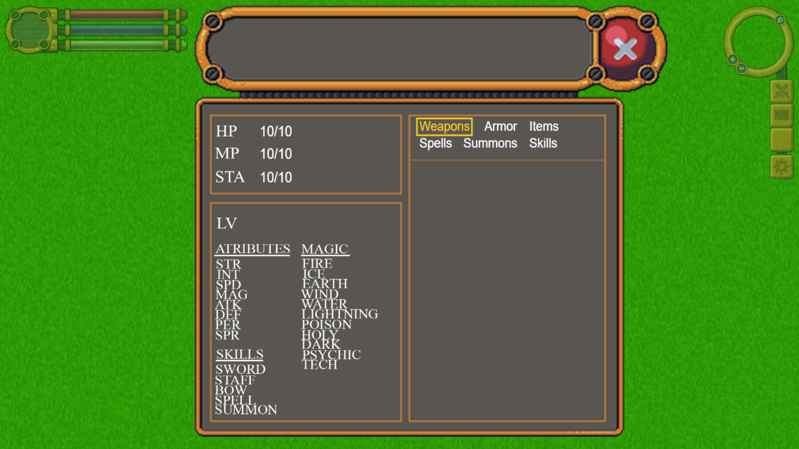

# Cyber Warlock

## Overview

This is a rpg web based game I am working on. It uses the Phaser 3 game engine, React components, and runs on a locally hosted web server using NodeJS.

## Running the app

At this time, check out v0.2.0

To run the app, there are 3 steps

* Run npm i to install dependencies. The project is currently configured with node version 16.0.0
* Run npm run build to build the dist folder. If the folder isn't there, you may need to add it.
* Run npm start to start the game
* Go to a web browser and type in localhost:80 to access it

## Controls

* W,A,S,D or Arrow Keys for movement
* Spacebar for melee attack
* E Changes the staff
* F raises your hand
* G uses your shield
* R changes your shield color
* Q does a jumping animation
* J uses a spell
* Z changes the current spell
* I opens inventory, so does clicking on the 2 swords on the right of the screen
* L opens prompt for loading a save (WIP)
* P pauses the screen (WIP)
* With the inventory open, W,A,S,D or Arrow Keys select each menu item

## Screenshots
  
  

